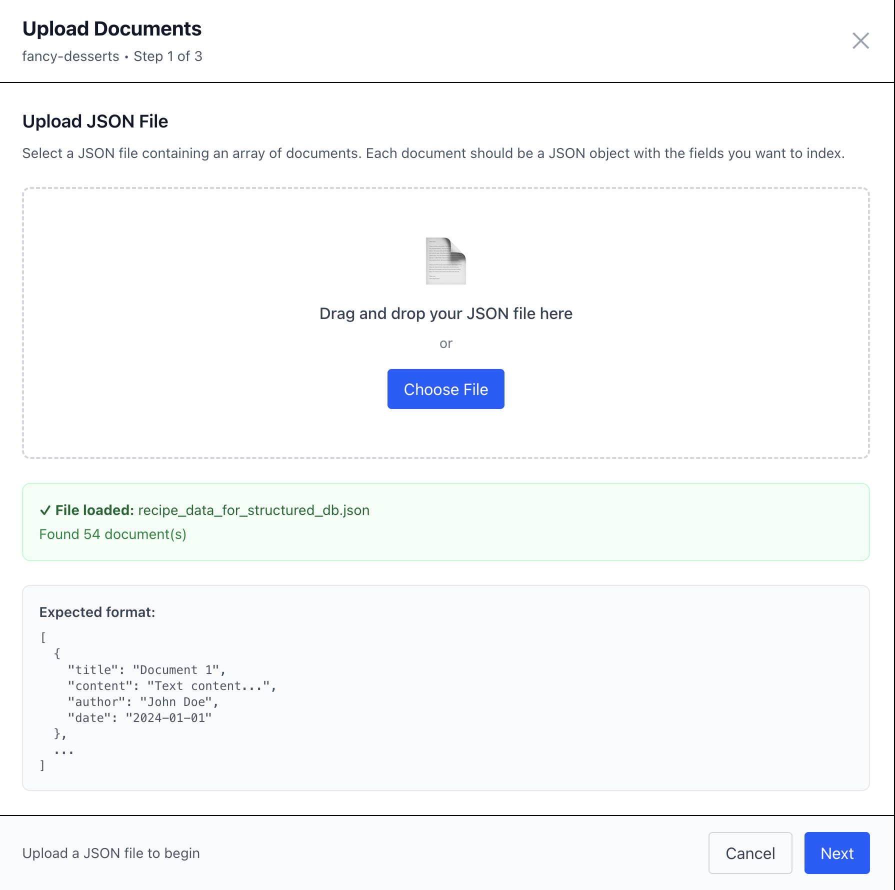
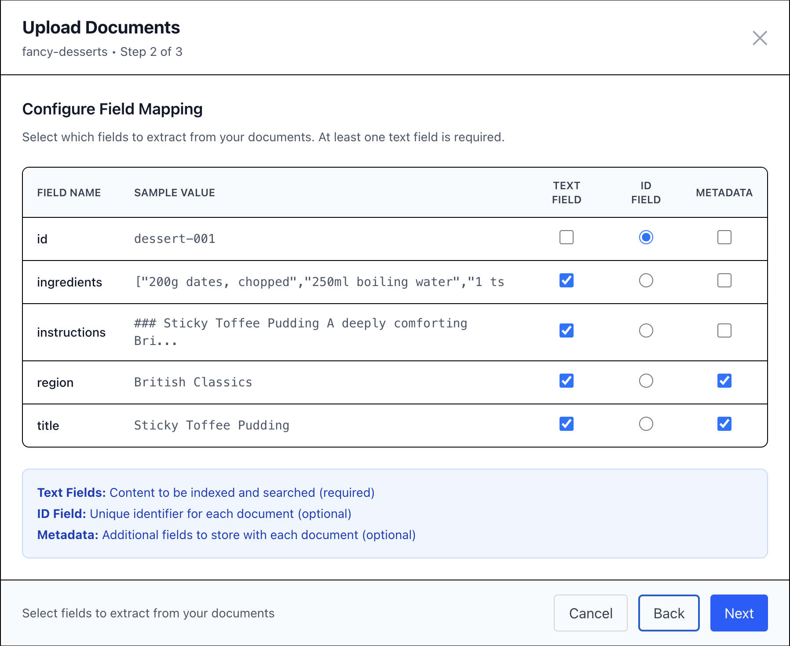
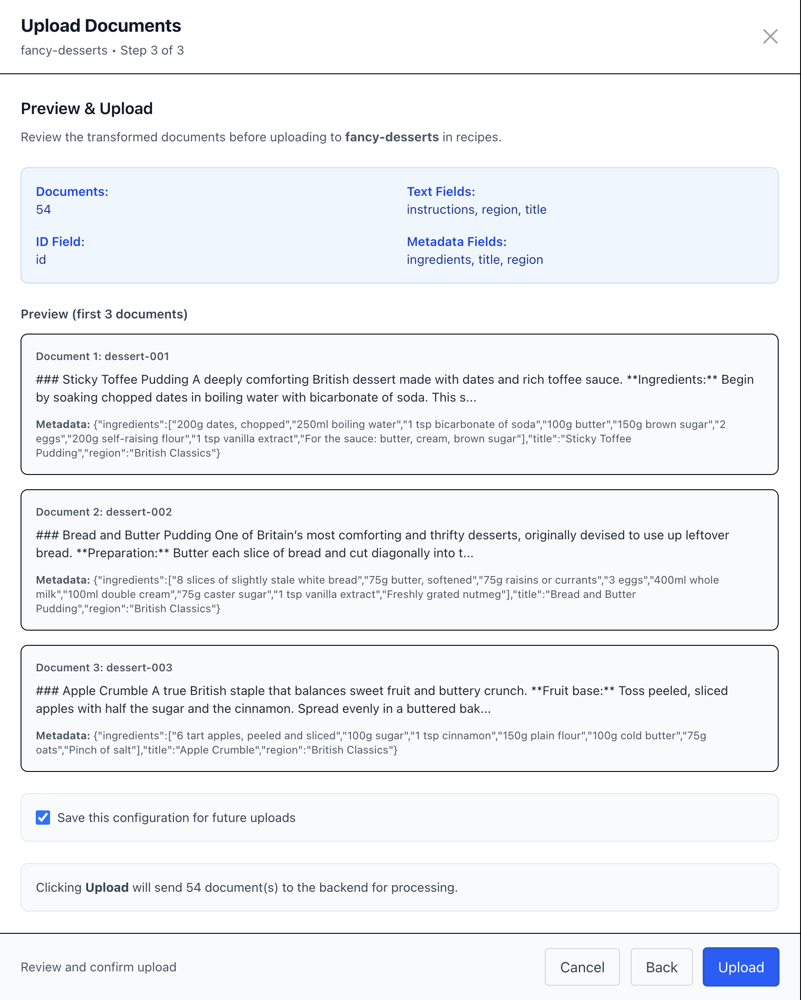

# Dynamic Collection Management System

This document describes the dynamic collection management feature that allows users to create, manage, and query knowledge bases through the UI without configuration file changes.

## Overview

The system now supports two types of knowledge bases:

1. **Configured Strategies** - Defined in `config.json` with explicit detection and response behavior
2. **Dynamic Collections** - User-created collections with metadata-driven behavior

## Architecture

```
Frontend (React)
    ↓
Chat Server (Node.js)
    ↓
    ├─→ Configured Strategies (config.json)
    └─→ Dynamic Collections (ChromaDB metadata)
          ↓
    ChromaDB Wrapper (Python FastAPI)
          ↓
    ChromaDB (Persistent Storage)
```

## How It Works

### 1. Collection Creation (UI)

Users can create new collections via `/collections` page:

**Collection Metadata:**
- `name` - Collection identifier
- `description` - What the collection is about
- `system_prompt` - LLM system prompt for answers from this collection
- `threshold` - Distance threshold for matching (0-2)
- `max_tokens` - Maximum tokens for responses
- `temperature` - LLM temperature setting

**Stored in ChromaDB:**
```json
{
  "name": "kubernetes_docs",
  "metadata": {
    "description": "Kubernetes documentation and best practices",
    "system_prompt": "You are a Kubernetes expert...",
    "threshold": 0.3,
    "max_tokens": 800,
    "temperature": 0.7
  }
}
```

### 2. Document Upload

The system provides **two upload methods** depending on your document format:

#### A. Upload JSON Wizard (Recommended for Raw Data)

**Use this for:** Raw JSON documents that need field mapping (e.g., recipes, products, articles)

**Access:** Click "Upload JSON" button on any collection in the Collections page

**The wizard guides you through 3 steps:**

##### Step 1: File Upload & Field Discovery



- **Drag & drop** or **select** a JSON file containing an array of objects
- System automatically discovers all available fields from the first document
- Shows preview of discovered fields and document structure
- Validates JSON format and array structure

**Example JSON:**
```json
[
  {
    "title": "Chocolate Chip Cookies",
    "ingredients": ["flour", "sugar", "chocolate chips"],
    "instructions": "Mix ingredients...",
    "prepTime": "15 minutes",
    "category": "dessert"
  },
  ...
]
```

##### Step 2: Field Mapping



For each discovered field, choose its role:

- **TEXT** - Used for semantic search (select at least one)
- **ID** - Unique identifier for the document (optional, auto-generated if not specified)
- **METADATA** - Additional attributes stored with the document
- **SKIP** - Ignore this field

**Smart Defaults:**
- If collection has a saved schema, fields are **pre-selected automatically**
- First upload requires manual mapping
- Schema is saved for future uploads (unless you uncheck "Save schema")

**Processing:**
- TEXT fields are concatenated with `\n\n` separator
- METADATA fields become searchable attributes
- Arrays are automatically flattened with commas
- Nested objects are JSON-stringified

##### Step 3: Preview & Upload



- **Preview** transformed documents (shows first 3)
- **Review** document count and settings
- **Configure** schema persistence:
  - ✅ **"Save this configuration for future uploads"** (default for new collections)
  - ⬜ **"Update existing schema"** (default when schema already exists)
- **Upload** to collection

**Behind the scenes:**
1. Frontend sends raw documents + transformation schema to backend
2. Backend transforms each document to `{id, text, metadata}` format and sends text-only to the RAG wrapper
3. Wrapper generates embeddings for the `text` field using the collection's embedding model
4. Documents stored in ChromaDB with metadata
5. Schema saved to collection metadata (if checkbox selected)

**Result:** Clean, searchable documents optimized for RAG retrieval!

---

#### B. Direct Document Upload (Pre-Formatted)

**Use this for:** Documents already in `{id, text, metadata}` format, or simple text files

**Access:** Click "Upload Documents" button on any collection

**Supported Formats:**
- Plain text (`.txt`)
- Markdown (`.md`)
- JSON with `{id, text, metadata}` structure
- Paste text directly

**Processing:**
1. Frontend sends pre-formatted documents to chat server
2. Chat server sends text-only documents to the RAG wrapper
3. Wrapper generates embeddings using the collection's embedding model and stores in ChromaDB

**When to use:**
- Uploading documentation files (.txt, .md)
- Documents already transformed externally
- Simple single-field content (no mapping needed)

### 3. Collection Selection (Chat UI)

In the chat interface, users see all available collections:

```
Search In:
☑ kubernetes_docs (245 docs)
☑ openshift_docs (189 docs)
☐ ansible_docs (127 docs)
```

**Features:**
- Select/deselect collections dynamically
- See document counts
- Hover for descriptions
- Select/Deselect all button

### 4. Query Detection Flow

When a user sends a message:

```javascript
{
  prompt: "How do I scale a deployment?",
  selectedCollections: ["kubernetes_docs", "openshift_docs"]
}
```

**Detection Process:**

1. **Configured Strategies First**
   - Check all strategies defined in `config.json`
   - If match found → use that strategy

2. **Dynamic Collections**
   - For each selected collection:
     - Get collection metadata (includes threshold, system prompt)
     - Query collection with user's question
     - If distance < threshold → MATCH!
     - Create dynamic strategy using metadata

3. **LLM Fallback**
   - If no matches → use LLM-based intent detection
   - Or fall back to default strategy

### 5. Response Generation with Metadata

When a dynamic collection matches:

```javascript
// Strategy created on-the-fly from collection metadata
{
  name: "DYNAMIC_kubernetes_docs",
  response: {
    provider: "openai",
    model: "gpt-4o-mini",
    system_prompt: "You are a Kubernetes expert...",  // From metadata!
    max_tokens: 800,
    temperature: 0.7
  }
}

// Context from collection
context: [
  "Kubernetes deployments can be scaled using kubectl scale...",
  "To scale a deployment, use: kubectl scale deployment/my-app --replicas=3...",
  "Horizontal Pod Autoscaler automatically scales..."
]
```

The LLM receives:
- The system prompt from collection metadata
- The context retrieved from the collection
- The user's question

Result: **Expert, context-aware response!**

## Key Benefits

### 1. No Configuration Changes

Users can:
- Create collections
- Upload documents
- Get expert answers

**Without touching `config.json`!**

### 2. Self-Contained Collections

Each collection stores its own behavior:
- System prompt defines expertise
- Threshold controls matching strictness
- Max tokens and temperature control response style

### 3. Flexible Deployment

**Development:**
- Users create test collections
- Experiment with different prompts/thresholds
- No server restarts needed

**Production:**
- Domain experts manage their collections
- IT manages core infrastructure
- Separation of concerns

### 4. Mixed Mode Operation

System supports both simultaneously:
- Critical paths use configured strategies
- User-managed content uses dynamic collections
- Best of both worlds!

## API Endpoints

### Collection Management

**List Collections:**
```http
GET /api/collections
Response: { collections: [{name, count, metadata, provider_name}] }
```

**Get Collection Info:**
```http
GET /api/collections/:name
Response: {name, count, metadata}
```

**Create Collection:**
```http
POST /api/collections
Body: {name, metadata: {description, system_prompt, threshold, ...}}
Response: {status, name, metadata}
```

**Add Documents:**
```http
POST /api/collections/:name/documents
Body: {documents: [{text, metadata}]}
Response: {status, count}
```

**Delete Collection:**
```http
DELETE /api/collections/:name
Response: {status, name}
```

**Check Wrapper Availability:**
```http
GET /api/collections/available
Response: {hasWrapper: boolean}
```

## UI Components

### `/collections` Page

**Features:**
- List all collections with metadata
- Create new collections with form
- Upload documents (files or text)
- Delete collections
- View document counts

**Conditional Display:**
- Only appears if `chromadb-wrapper` provider configured
- NavBar shows "Collections" link when available

### `/chat` Page Collection Selector

**Features:**
- Displays all available collections
- Checkbox selection
- Select/Deselect all
- Shows document counts
- Tooltip with descriptions
- Visual indication of selection

## Configuration

### Enable Dynamic Collections

Add a `chromadb-wrapper` provider without specifying a collection:

```json
{
  "knowledge_bases": {
    "dynamic_wrapper": {
      "type": "chromadb-wrapper",
      "url": "http://localhost:5006"
      // No collection specified - supports all collections!
    }
  }
}
```

Or specify a default collection but still allow dynamic queries:

```json
{
  "knowledge_bases": {
    "default_docs": {
      "type": "chromadb-wrapper",
      "url": "http://localhost:5006",
      "collection": "default_knowledge"  // Default, but can query others
    }
  }
}
```

### Python Wrapper Requirements

The wrapper service must be running with collection management endpoints:
- Use `backend/rag/server.py` (enhanced version)
- Not `server-orig.py` (basic version)

## Example Workflow

### 1. Create a Collection

```
User → /collections
  → Click "Create New Collection"
  → Fill form:
     Name: "docker_best_practices"
     Description: "Docker containerization best practices"
     System Prompt: "You are a Docker expert..."
     Threshold: 0.25
  → Submit
```

### 2. Upload Documents

**Option A: Using the Wizard (for raw JSON data):**

```
User → Select collection: "docker_best_practices"
  → Click "Upload JSON"
  → Step 1: Upload recipes.json (array of Docker tip objects)
  → Step 2: Map fields:
     - TEXT: tip_title, tip_description
     - ID: tip_id
     - METADATA: category, difficulty
  → Step 3: Preview, check "Save schema", Upload
  → Documents transformed and embedded
  → Schema saved for next time
```

**Option B: Using direct upload (for .txt/.md files):**

```
User → Select collection: "docker_best_practices"
  → Click "Upload Documents"
  → Upload files:
     - docker_compose_guide.md
     - dockerfile_best_practices.txt
     - container_security.md
  → Submit
  → Documents processed and embedded
```

### 3. Chat with Collection

```
User → /chat
  → See collection: ☐ docker_best_practices (3 docs)
  → Check the box
  → Ask: "What are the best practices for Dockerfile?"
  → System queries collection
  → Finds match (distance: 0.18 < 0.25)
  → Uses collection's system prompt
  → Returns expert Docker answer!
```

## Metadata Fields Reference

| Field | Type | Required | Default | Description |
|-------|------|----------|---------|-------------|
| `description` | string | No | "" | Human-readable description |
| `system_prompt` | string | No | Generic | LLM system prompt for responses |
| `threshold` | number | No | 0.3 | Match threshold (0-2, lower = stricter) |
| `max_tokens` | number | No | 800 | Maximum tokens in response |
| `temperature` | number | No | 0.7 | LLM creativity (0-2) |
| `document_schema` | string | No | - | JSON string with saved field mapping (text_fields, id_field, metadata_fields) |
| `created_at` | string | No | - | ISO timestamp of creation |

## Best Practices

### Collection Design

**Good Collection:**
- Focused topic (e.g., "kubernetes_networking")
- Clear system prompt with expertise
- Appropriate threshold for content

**Poor Collection:**
- Too broad (e.g., "everything")
- Generic prompt
- Threshold too high (matches everything)

### System Prompts

**Good:**
```
You are a Kubernetes networking expert. Provide detailed, 
accurate answers about Kubernetes Services, Ingress, 
NetworkPolicies, and CNI plugins. Include kubectl examples 
when relevant.
```

**Poor:**
```
Answer questions.
```

### Threshold Tuning

- **0.1-0.2**: Very strict, only near-perfect matches
- **0.2-0.3**: Good for focused collections
- **0.3-0.5**: Broader matching
- **0.5+**: May match too loosely

**Tip:** Start with 0.3, adjust based on results

### Document Quality

**Good Documents:**
- Well-structured
- Clear topics
- Reasonable length (not too long/short)
- Relevant to collection purpose

**Poor Documents:**
- Very short snippets
- Mixed unrelated topics
- Excessively long (split them!)

## Limitations

1. **Wrapper Provider Only**
   - Dynamic collections only work with `chromadb-wrapper` type
   - Direct `chromadb` type uses fixed collections

2. **No Metadata Update**
   - Can't update collection metadata after creation
   - Would require collection recreation

3. **Single Wrapper**
   - All dynamic collections from same wrapper service
   - Can't span multiple wrapper instances

4. **Embedding Model Per Collection**
   - Each collection has an `embedding_model` in metadata (from the wrapper's available models)
   - Defined in the wrapper service and set when the collection is created

## Troubleshooting

**Collections not showing:**
- Check wrapper provider is configured
- Verify wrapper service is running
- Check `/api/collections/available` endpoint

**No matches found:**
- Lower threshold value
- Add more relevant documents
- Check document quality

**Wrong answers:**
- Improve system prompt specificity
- Add more context documents
- Adjust temperature setting

**Upload fails:**
- Check file format (.txt, .md, .json)
- Verify OpenAI API key in wrapper
- Check wrapper logs for errors

## Future Enhancements

### Collection Management
- Edit collection metadata after creation
- Document management (view, delete individual docs)
- Collection analytics (query stats, popular docs)
- Import/export collections
- Collection templates
- Collection sharing
- Version control for collections

### Upload Wizard Enhancements
- ~~Visual field mapping wizard~~ ✅ **COMPLETED**
- ~~Schema persistence and reuse~~ ✅ **COMPLETED**
- Support for JSONL files (line-delimited JSON)
- Custom text separators per upload
- Static metadata key-value inputs
- Validation for required fields
- Field type detection (string, number, boolean)
- Preview more than 3 documents
- Undo/edit after upload
- Batch uploads with progress tracking

