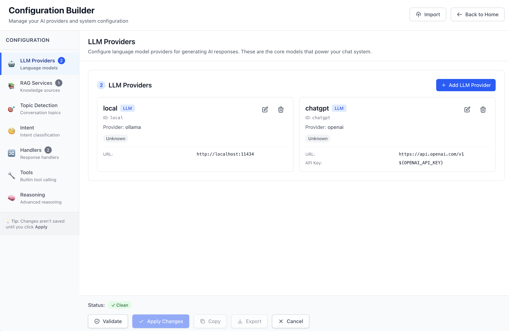
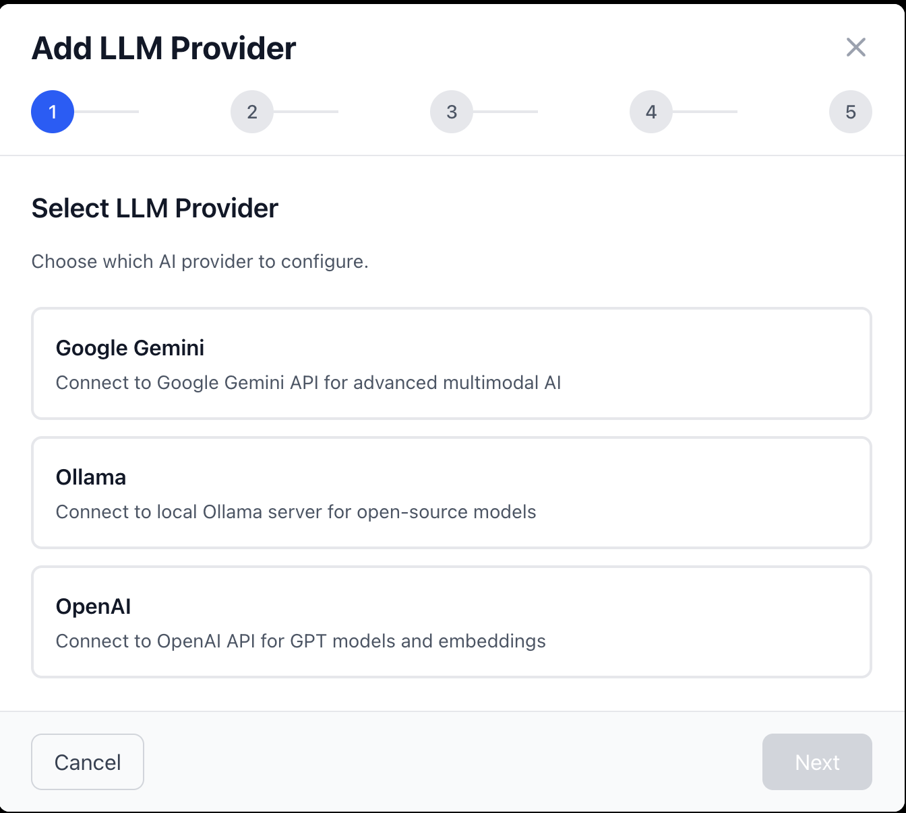
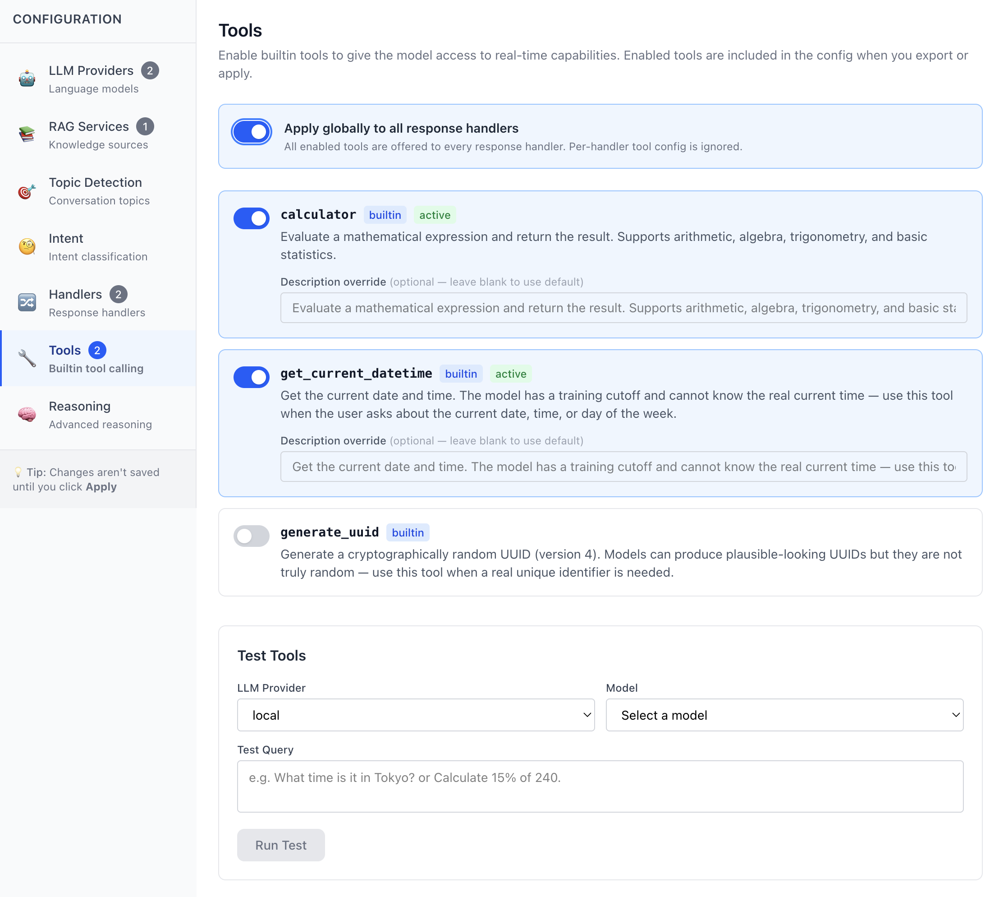
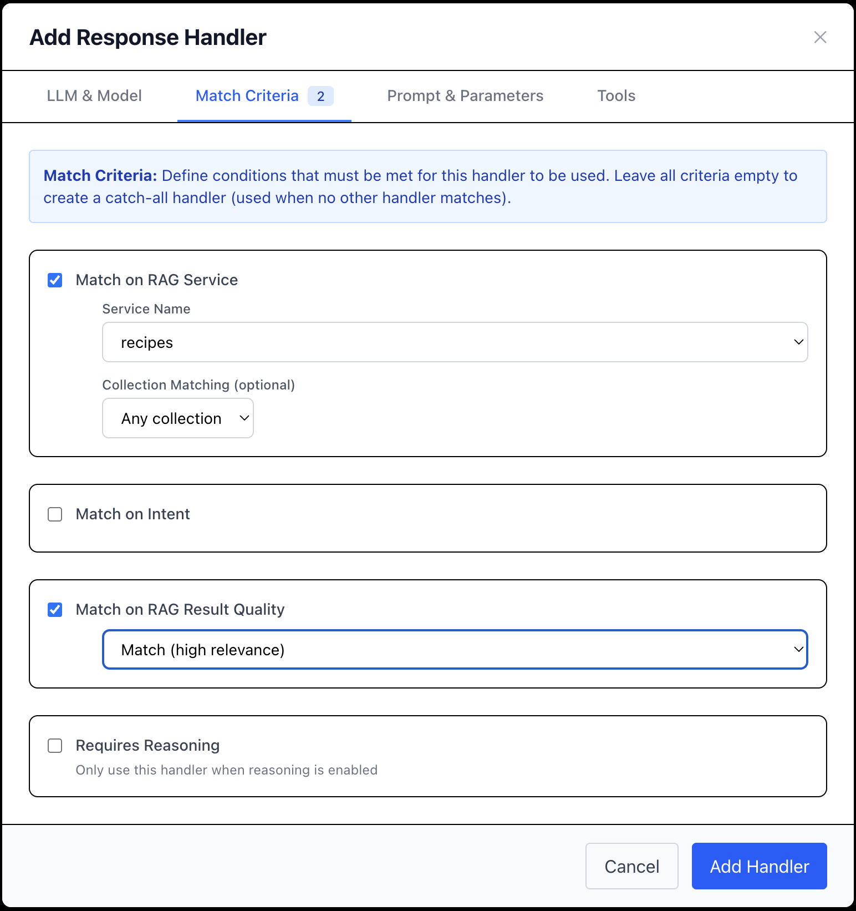

# Configuration Builder

The Configuration Builder is a comprehensive UI for creating and managing Flex Chat configurations without manually editing JSON files. It provides a zero-config startup experience, visual configuration management, and live testing of providers.

## Quick Start

### Starting from Zero Config

1. **Start the server** without a configuration file:
   ```bash
   npm start
   ```

2. **Navigate to the Configuration Builder** from the welcome screen or click "Configuration" in the top-right

3. **Add your first LLM Provider** using the wizard

4. **Validate and Apply** your configuration to start chatting

### Starting from Existing Config

If you have an existing `config.json`, the Configuration Builder will load it automatically and allow you to edit it through the UI.

## Features

### LLM Provider Management

**Add, edit, and remove LLM providers** through a guided wizard:

- **Supported Providers**: OpenAI, Ollama, Gemini, Anthropic
- **Connection Testing**: Verify connectivity before saving
- **Model Discovery**: Automatically fetch available models from each provider
- **Environment Variable Support**: Securely reference API keys via `${ENV_VAR}` syntax
- **Default Model Selection**: Choose a preferred model for each provider

**Wizard Steps**:
1. Select Provider (OpenAI, Ollama, Gemini)
2. Configure Connection (URL, API keys via env vars)
3. Test Connection & Discover Models
4. Select Default Model
5. Name and Save

### RAG Service Management

**Add and configure RAG services** for vector search:

- **Supported Providers**: ChromaDB Wrapper, Milvus, Qdrant, Pinecone
- **Connection Testing**: Verify connectivity and health
- **Collection Discovery**: See available collections after successful connection
- **Collection Details**: View document counts and descriptions
- **Match Thresholds**: Configure similarity thresholds for matches

**Wizard Steps**:
1. Select Provider
2. Configure Connection (URL, credentials)
3. Test Connection (displays available collections)
4. Name and Save

**Note**: Embedding models are configured in the RAG wrapper (Python) and per collection. When creating collections, you choose an embedding model from the wrapper's available models (see [CHROMADB_WRAPPER.md](CHROMADB_WRAPPER.md) and [COLLECTION_MANAGEMENT.md](COLLECTION_MANAGEMENT.md)).

### Tools Configuration

**Enable or disable builtin tools** for response handlers that use tool calling:

- **Tools Tab**: Appears when at least one LLM provider is configured; shows count of enabled tools in the tab badge
- **Available Builtins**: Cards for each builtin tool (e.g. from the builtin tools manifest); toggle to enable or disable
- **Apply Globally toggle**: When on, all enabled tools are offered to every response handler automatically — no need to configure `tools.enabled` per handler. When off (default), only handlers that explicitly have `tools.enabled: true` use tools (useful when some handlers use models that don't support function calling).
- **Description Override**: Optionally override a tool's description per tool when enabled
- **Inline Testing**: Test tools against the working config from the Tools section

Tools are stored in config as `tools.registry` (array of `{ name, description? }`). Response handlers can enable tool calling via `tools.enabled` and optionally `tools.max_iterations`. Only models with tool/function-calling capability (🔧 badge) can use tools.

### Topic Detection Configuration

**Configure conversation topic detection** (Phase 1 of the 6-phase chat flow):

- **Provider Selection**: Choose which LLM to use for topic detection
- **Model Selection**: Select a chat-capable model (filtered automatically)
- **Custom Prompts**: Write custom topic detection prompts with variable substitution
  - Use `{{currentTopic}}`, `{{conversationContext}}`, `{{userMessage}}` placeholders
  - Click placeholders to insert them at cursor position
  - Load default prompt as a starting point
- **Testing**: Test prompts against saved conversations to see topic evolution
  - Select a conversation from your chat history
  - Analyze how topics are detected through the entire conversation
  - See topic changes, continuations, and raw model responses
- **Auto-Configuration**: Automatically set up when adding your first LLM
- **Fallback Logic**: Uses intent or first response handler if not explicitly configured

**📖 For detailed documentation on topic detection customization, testing, and best practices, see [Topic Detection Guide](TOPIC_DETECTION.md)**

**Smart Features**:
- Only shows chat-capable models (excludes reasoning/audio/video/embedding)
- Auto-corrects if configured provider is deleted
- Warning banner for invalid configurations

### Configuration Management

**Import, validate, apply, and export** your configuration:

- **Import**: Load configuration from JSON file (header button)
  - Replaces current configuration with confirmation dialog
  - Warns if you have unsaved changes
  - Validates JSON structure and shows actionable errors
- **Validation**: Check for errors before applying (referential integrity, missing requirements)
- **Apply**: Hot-reload configuration without restarting the server (requires validation)
- **Export**: Download your configuration as JSON file
  - Prompts for filename with timestamped default (e.g., `flex-chat-config-2025-11-08T14-30-00.json`)
  - Automatically adds `.json` extension if missing
- **Copy to Clipboard**: Copy configuration JSON to clipboard for easy sharing/backup
  - Modern browsers: uses `navigator.clipboard.writeText()`
  - Legacy browsers: falls back to `document.execCommand('copy')`
- **Cancel**: Discard unsaved changes and return to home
- **Unsaved Changes Banner**: Visual indicator when you have unapplied changes

### Zero-Config Bootstrap

**Start chatting immediately**:

- Add your first LLM → automatic response handler created
- Add your first LLM → automatic topic and intent detection configured
- No manual JSON editing required

### Enhanced Chat UX

**Automatic UX improvements**:

- **Chat UI Guards**: Prevents access to chat without a working configuration
- **Auto-Title Updates**: Chat titles automatically update from detected topics (first 5 messages)
- **Manual Edit Respect**: Once you rename a chat, auto-updates stop
- **New Chat on Provider Changes**: Fresh chat session when you add/remove providers
- **Empty Session Cleanup**: Automatically deletes empty chats when switching

## Using the Configuration Builder

### Navigation

The Configuration Builder uses a tabbed interface with the following sections:



| Tab | Icon | Description | Enabled When |
|-----|------|-------------|--------------|
| **LLM Providers** | 🤖 | Manage LLM providers | Always |
| **RAG Services** | 📚 | Manage RAG services | Always |
| **Tools** | 🔧 | Enable/disable builtin tools for tool calling | LLM providers exist |
| **Topic Detection** | 🎯 | Configure topic detection | LLM providers exist |
| **Intent** | 🧐 | Configure intent detection | LLM providers exist |
| **Handlers** | 🎮 | Build response handlers | LLM providers exist |
| **Reasoning** | 💭 | Configure reasoning models | Coming soon |

### Adding an LLM Provider



1. Navigate to **LLM Providers** tab
2. Click **Add LLM Provider**
3. **Select Provider** (OpenAI, Ollama, Gemini)
4. **Configure Connection**:
   - For Ollama: Base URL (e.g., `http://localhost:11434`)
   - For OpenAI/Gemini: API key via environment variable (e.g., `${OPENAI_API_KEY}`)
5. **Test Connection**: Click to verify and discover models
6. **Select Default Model**: Choose your preferred model
7. **Name Provider**: Give it a unique name (e.g., "local", "production-openai")
8. **Save**

The first LLM you add will automatically:
- Create a default response handler
- Configure topic detection
- Configure intent detection
- Make the chat interface ready

### Adding a RAG Service

1. Navigate to **RAG Services** tab
2. Click **Add RAG Service**
3. **Select Provider** (ChromaDB Wrapper, etc.)
4. **Configure Connection**:
   - URL (e.g., `http://localhost:5006`)
   - Match thresholds (e.g., 0.2 for match, 0.45 for partial)
5. **Test Connection**: Click to verify and view available collections
6. **Review Collections**: See collection names, document counts, descriptions
7. **Name Service**: Give it a unique name
8. **Save**

### Configuring Tools



1. Navigate to **Tools** tab (enabled when at least one LLM is configured)
2. **Enable/Disable**: Toggle each builtin tool on or off; enabled tools appear in `tools.registry`
3. **Description Override** (optional): For enabled tools, you can set a custom description
4. **Test**: Use the inline test panel to try tools against the current working config

Handlers that have `tools.enabled` will receive the enabled tools when using a model with tool-calling capability (🔧).

### Configuring Topic Detection

1. Navigate to **Topic Detection** tab
2. **Select Provider**: Choose which LLM to use
3. **Select Model**: Choose a chat-capable model
4. Changes save automatically (no Save button)

**Note**: Topic detection is automatically configured when you add your first LLM, but you can customize it here.

### Configuring Intent Detection

1. Navigate to **Intent** tab
2. **Select Provider**: Choose which LLM for intent classification
3. **Select Model**: Choose a chat-capable model (⚡ indicates fast models ideal for classification)
4. **Add Intents**: Define intent name and description pairs
   - Example: `cooking` → `Questions about cooking, recipes, food preparation`
5. **Test Intents**: Use the modal to test classifications
   - Select RAG collections to include in test (combines general intents with specific collections)
   - See which intent matches your test query

**Note**: The system supports hierarchical intent matching - RAG collection descriptions act as specific intents and naturally take priority over general configured intents.

### Building Response Handlers

**Response Handlers** determine which LLM and prompt to use for a query based on match criteria. Handlers are evaluated top-to-bottom, and the **first match wins**.



1. Navigate to **Handlers** tab
2. **View Existing Handlers**: See all handlers in execution order (numbered)
3. **Add Handler**: Click "+ Add Handler"
4. **Configure in Modal**:

**Basic Tab**:
- **LLM Provider**: Select from configured LLMs
- **Model**: Choose model (filtered to chat-capable, shows badges: ⚡ fast, 🎨 vision, 🔧 tools, 📚 large context)
- **Max Tokens**: Set response length limit

**Match Tab** (optional - leave empty for catch-all):
- **Service**: Match specific RAG service
- **Collection**: Match exact collection name or contains substring
- **Intent**: Match specific intent or regex pattern
- **RAG Results**: Match based on RAG query results (match/partial/none/any)
- **Reasoning**: Match when reasoning is enabled

**Prompt Tab**:
- **Prompt Template**: Write your system prompt
- **Variables**: Click to insert `{{rag_context}}`, `{{reasoning}}`, `{{topic}}`, etc.

**Handler Ordering**:
- Use **↑/↓ arrows** to reorder handlers
- **Catch-all handler** (no match criteria) should be last - shown with purple badge
- Warnings appear if handlers are unreachable or catch-all isn't last

**Example Handlers**:
1. Handler #1: RAG service=`rag-wrapper` + collection contains `openshift` → Use Gemini Flash (fast, specific)
2. Handler #2: Intent=`cooking` → Use GPT-4 (creative, detailed)
3. Handler #3: RAG results=`none` → Use Claude (reasoning, general knowledge)
4. Handler #4: (catch-all) → Use Ollama Llama3 (default)

### Validating and Applying Configuration

1. Make changes in any section
2. **Unsaved Changes Banner** appears at the top
3. Click **Validate** to check for errors
4. Review any errors or warnings
5. Fix issues if needed, validate again
6. Click **Apply** to hot-reload the configuration
7. Navigate to Home and start chatting

**Validation Checks**:
- At least one LLM provider configured
- At least one response handler configured
- All LLM references are valid (topic, intent, responses)

## Configuration Structure

The Configuration Builder generates JSON with the following structure:

```json
{
  "llms": {
    "<provider-name>": {
      "provider": "ollama|openai|gemini",
      "baseUrl": "http://localhost:11434",
      "apiKey": "${OPENAI_API_KEY}",
      "default_model": "qwen2.5:3b-instruct"
    }
  },
  "rag_services": {
    "<service-name>": {
      "provider": "chromadb-wrapper",
      "url": "http://localhost:5006",
      "match_threshold": 0.2,
      "partial_threshold": 0.45
    }
  },
  "tools": {
    "enabled": true,
    "max_iterations": 5,
    "registry": [
      { "name": "builtin_tool_name" }
    ]
  },
  "topic": {
    "provider": {
      "llm": "<provider-name>",
      "model": "qwen2.5:3b-instruct"
    }
  },
  "intent": {
    "provider": {
      "llm": "<provider-name>",
      "model": "qwen2.5:3b-instruct"
    }
  },
  "responses": [
    {
      "match": {
        "rag_results": "match"
      },
      "prompt": "Use the following context:\n\n{{rag_context}}",
      "llm": "<provider-name>",
      "model": "qwen2.5:7b-instruct",
      "max_tokens": 1000
    }
  ]
}
```

### Key Concepts

- **Provider Names**: User-defined identifiers for LLM providers (e.g., "local", "production")
- **Environment Variables**: Secrets referenced as `${VAR_NAME}`, never stored as plaintext
- **LLM References**: Other sections reference LLMs by their provider name (topic, intent, responses)
- **Embeddings**: Configured in the RAG wrapper and per collection, not in this config

## Environment Variables

### Security Model

The Configuration Builder enforces environment variable usage for secrets:

- **Secret fields** (API keys, tokens) ONLY accept environment variable references
- **Auto-wrap**: Typing `OPENAI_API_KEY` automatically becomes `${OPENAI_API_KEY}`
- **Suggestions**: Shows available environment variables matching field names
- **Never Exposed**: Actual secret values never sent to the browser

### Setting Environment Variables

Create a `.env` file or set in your environment:

```bash
# OpenAI
OPENAI_API_KEY=sk-...

# Gemini
GEMINI_API_KEY=...

# Custom
MY_API_KEY=...
```

The Configuration Builder will suggest these variables in the appropriate fields.

## Hot-Reload

The Configuration Builder supports **hot-reload** - applying configuration changes without restarting the server:

1. Make changes in the UI
2. Click **Validate** then **Apply**
3. Server reloads configuration
4. Provider connections are re-initialized
5. UI reflects new configuration immediately

**What triggers a new chat session**:
- Adding, removing, or renaming LLM providers
- Adding, removing, or renaming RAG services

When providers change, the Configuration Builder automatically creates a fresh chat session to avoid confusion with old provider contexts.

## Model Caching

The Configuration Builder caches model lists for performance:

- **Shared Cache**: Models fetched once, shared across all sections
- **Persistent**: Cache persists when navigating between tabs
- **Smart Filtering**: Each section filters cached models to show only relevant types (e.g. topic detection: chat-capable models only)

## API Reference

### Backend Endpoints

The Configuration Builder uses the following APIs:

#### Provider Discovery
- `GET /api/connections/providers` - List all available providers

#### LLM Provider Management
- `POST /api/connections/llm/test` - Test LLM connection
- `POST /api/connections/llm/discovery/models` - Discover models from provider configuration

#### RAG Service Management
- `POST /api/connections/rag/test` - Test RAG connection (includes collections)

#### Configuration Management
- `GET /api/config/export` - Export current configuration
- `POST /api/config/validate` - Validate configuration
- `POST /api/config/reload` - Hot-reload configuration

#### Environment Variables
- `GET /api/connections/env-vars` - List available environment variables (filtered)

#### UI Status
- `GET /api/ui-config` - Configuration status for UI decision-making
  - `hasConfig`: Whether config file exists
  - `isZeroConfig`: Whether running in zero-config mode
  - `hasWorkingProviders`: At least one LLM connected
  - `hasResponseHandlers`: At least one response handler configured
  - `chatReady`: Chat interface is ready to use

## Troubleshooting

### "No models available" error

**Cause**: The provider connection is working but no models match the filter.

**Solutions**:
- For topic detection: Ensure your provider has chat models
- Check the provider's model list using their native tools (e.g., `ollama list`)

### "Provider connection failed" error

**Cause**: Cannot connect to the provider.

**Solutions**:
- Verify the provider is running (e.g., Ollama at `http://localhost:11434`)
- Check firewall settings
- Verify environment variables are set correctly
- Test connection manually with curl

### "Validation failed" errors

**Cause**: Configuration has referential integrity issues.

**Common Issues**:
- Topic detection references a deleted LLM provider
- Response handler references a deleted LLM provider

**Solution**: 
- Fix the references to point to existing providers
- The UI will auto-correct some issues and show warnings

### Configuration not saving

**Cause**: Validation must pass before you can apply changes.

**Solution**:
1. Click **Validate** to see errors
2. Fix all errors (warnings are okay)
3. Click **Validate** again
4. Once validation passes, **Apply** button becomes enabled

## Best Practices

### Provider Naming
- Use descriptive names: `local-ollama`, `production-openai`, `dev-gemini`
- Avoid spaces and special characters (use hyphens or underscores)
- Keep names short but meaningful

### Environment Variables
- Name API keys clearly: `OPENAI_API_KEY`, `GEMINI_API_KEY`
- Use a `.env` file for local development
- Never commit `.env` files to version control

### Configuration Management
- Validate frequently as you make changes
- Export your configuration periodically as backup
- Test your configuration in chat before committing changes
- Use meaningful provider names for easier debugging

### Zero-Config Workflow
1. Add LLM provider (auto-creates response handler, topic, intent)
2. Test chat (verify it works)
3. Add RAG service (embedding model is chosen per collection in the RAG wrapper)
4. Optionally enable tools in the Tools tab for handlers that use tool calling
5. Test RAG-enhanced chat (and tool calling if enabled)
6. Export configuration as backup

## See Also

- [Topic Detection Guide](./TOPIC_DETECTION.md) - Customizing and testing topic detection prompts
- [Configuration Schema](./CONFIGURATION.md) - JSON schema reference
- [Architecture](./ARCHITECTURE.md) - System architecture overview
- [Provider Comparison](./PROVIDER_COMPARISON.md) - LLM provider capabilities

